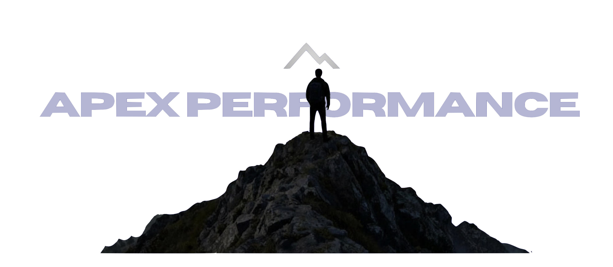

# 🏔️ Hero Image Update - December 9, 2024

## What Changed

Your landing page hero section has been updated to feature your stunning mountain peak image prominently above the headline.

## The New Hero Layout

### Image Placement
- **Your hero image** is now displayed at the top of the page
- **Full-width display** with rounded corners and dramatic shadow
- **Above the headline** "Performance, Seen Clearly"
- **Fade-in animation** on page load for elegant entrance

### Image Details
- **Source**: `hero-image.png` (your uploaded mountain peak image)
- **Alt text**: "Apex Performance - Person at mountain peak"
- **Styling**: Rounded corners, box shadow, responsive width
- **Animation**: Smooth fade-in effect when page loads

## Design Features

### Visual Hierarchy
1. **Hero image** (top) - Person at mountain peak with branding
2. **Main headline** - "Performance, Seen Clearly"
3. **Tagline** - "From the peak of experience"
4. **Description** - Your value proposition
5. **Call-to-action buttons** - Schedule consultation & Explore services

### Centered Layout
- All content is now centered for maximum impact
- Text flows naturally after the image
- Perfect symmetry and balance
- Mobile-optimized stacking

### Animations
- Hero image fades in from below (1s delay)
- Headline appears next (1.2s delay)
- Tagline follows (1.4s delay)
- Description text (1.6s delay)
- Buttons appear last (1.8s delay)
- Creates a smooth, professional reveal effect

## Technical Implementation

### CSS Updates
- New `.hero-image-container` class for image wrapper
- `.hero-main-image` class for the actual image
- Updated hero flex layout (changed from grid to column)
- Added fade-in animation keyframes
- Responsive sizing for all screen sizes

### HTML Structure
```html
<section class="hero">
    <!-- Image first -->
    <div class="hero-image-container">
        
    </div>
    
    <!-- Content below -->
    <div class="hero-content">
        <div class="hero-text">
            <h1>Performance, Seen Clearly</h1>
            <!-- Rest of content -->
        </div>
    </div>
</section>
```

## File Naming

The hero image is saved as:
- **Filename**: `hero-image.png`
- **Location**: Same folder as `index.html`
- **Original**: `Screenshot_2025-12-09_at_13_24_50.png` (renamed for simplicity)

## Why This Layout Works

### 1. Visual Impact
- The mountain peak image immediately establishes your brand identity
- The person at the summit reinforces the "apex" concept
- Creates emotional connection before visitors read anything

### 2. Brand Storytelling
- Image shows someone who's reached the peak (your experience)
- Supports the "sherpa" and "peak clarity" metaphors
- Professional photography quality

### 3. User Experience
- Image loads first, grabbing attention
- Text provides context after visual hook
- Clear hierarchy guides the eye naturally

### 4. Mobile Optimization
- Image scales perfectly on all devices
- Text remains readable below
- Maintains impact even on small screens

## Responsive Behavior

### Desktop (>968px)
- Full-width image with 1400px max-width
- Large headline (4.5rem)
- Centered layout with generous spacing

### Tablet (600-968px)
- Image scales proportionally
- Headline reduces to 3rem
- Maintains clean layout

### Mobile (<600px)
- Image stacks naturally
- Headline 2.5rem for readability
- All content single-column
- Touch-friendly buttons

## Color & Styling Details

### Image Container
- Max-width: 1400px
- Padding: 0 5% (responsive side margins)
- Margin-bottom: 3rem (space before text)
- Z-index: 1 (above background pattern)

### Image Itself
- Width: 100% (responsive)
- Height: Auto (maintains aspect ratio)
- Border-radius: 15px (rounded corners)
- Box-shadow: 0 30px 80px rgba(0,0,0,0.5) (dramatic depth)

### Background
- Dark gradient (black to dark gray)
- Subtle geometric pattern overlay
- Creates contrast for white text

## Editing the Hero Image

### To Change the Image
**Line ~806** in `index.html`:
```html

```

### To Adjust Image Size
**Lines ~173-180** in CSS:
```css
.hero-main-image {
    width: 100%;
    height: auto;
    border-radius: 15px;
    /* Adjust these values */
}
```

### To Change Animation Speed
**Lines ~183-191** in CSS:
```css
@keyframes fadeInUp {
    /* Animation properties */
}
```

Change animation duration in **Line ~181**:
```css
animation: fadeInUp 1s ease-out; /* Change 1s to 0.5s for faster */
```

## Perfect Alignment with Your Brand

This hero section now perfectly captures:
- ✅ **Peak concept** - Visual mountain summit
- ✅ **Clarity** - Clear view from the top
- ✅ **Experience** - Person who's made the journey
- ✅ **Professional** - High-quality photography
- ✅ **Impact** - Immediate visual statement

## Benefits of This Update

1. **Stronger First Impression** - Visual hooks visitors immediately
2. **Brand Consistency** - Image matches logo and concept
3. **Emotional Connection** - Aspirational imagery resonates
4. **Professional Quality** - Elevated visual standards
5. **Clear Messaging** - Image supports written content

## Files Included

Your download now includes:
1. **index.html** - Updated with new hero layout
2. **hero-image.png** - Your mountain peak image (ready to use)
3. All other files remain the same

## Testing Checklist

Before deploying:
- [ ] Open index.html in browser
- [ ] Check that hero image appears
- [ ] Verify image is above headline
- [ ] Test responsive sizing (resize browser)
- [ ] Check animation plays smoothly
- [ ] Ensure text is readable over background
- [ ] Test all buttons still work

## Quick Fixes

**Image not showing?**
- Ensure `hero-image.png` is in same folder as `index.html`
- Check filename matches exactly (case-sensitive)

**Image too large?**
- It will auto-scale to container width
- Max-width is set to 1400px

**Animation too fast/slow?**
- Adjust timing in CSS (line ~181)

## What's Next?

Your landing page now has:
- ✅ Your stunning hero image
- ✅ Your three core services
- ✅ Professional design and animations
- ✅ Complete branding integration

**Ready to deploy!** Follow QUICK-START.md to get live.

---

*Your hero section now makes a powerful visual statement that perfectly represents Apex Performance* 🏔️
